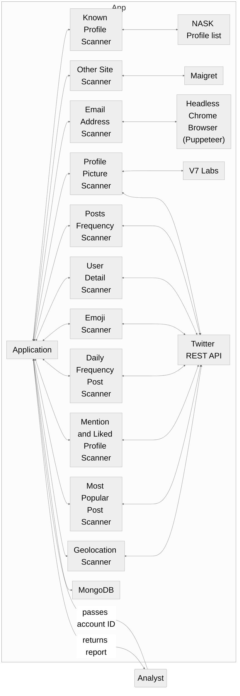
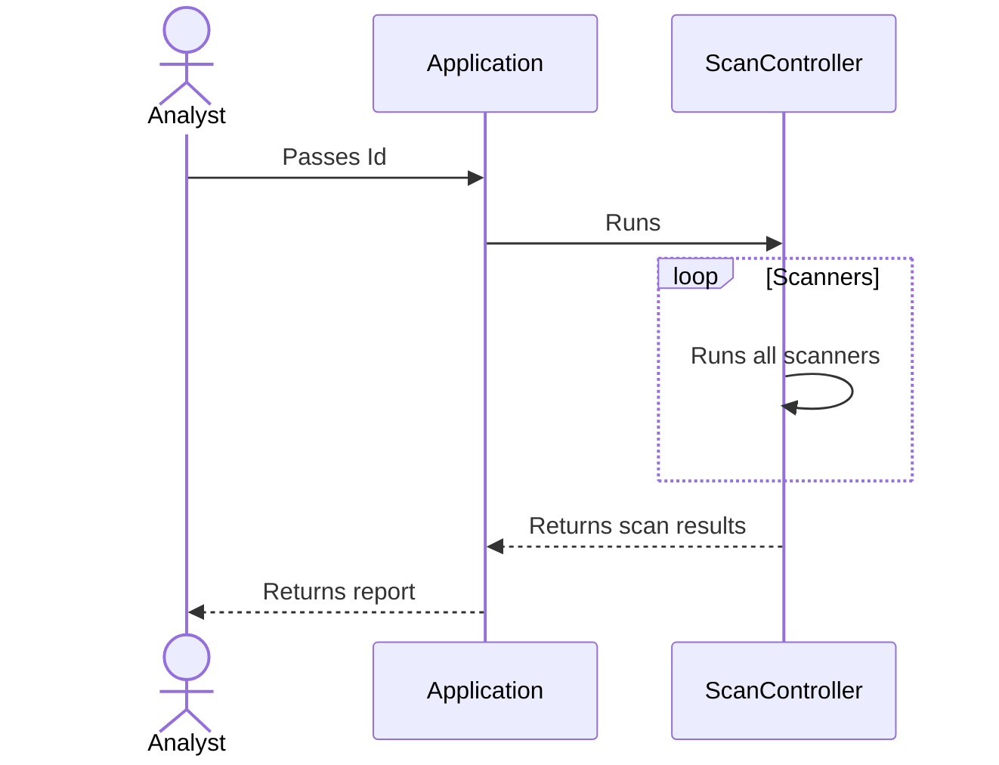

# Twitter Automation Scanner

The application is an automation prepared for Master thesis research and experimenting purposes. The goal of such an automation is to speed up the process of verifying whether the investigated Twitter account can be treated as a potential fake. The scanning process checks the following list of resources:

* Checks the email address - as Twitter does not share the full email address we are not able to get it in a legal way. However it provides a few letters and the length of the email address that is a hint in the investigation. Note that Twitter is not willing to share the email address, there's a chance that the script won't work, e.g. some additional step will be required. Fetching email address bases on a reset password process. Sometimes this process requires passing some additional data that the script is not able to have - phone number or... email that is supposed to be fetched. 
* Verifies whether a profile picture from scanned profile is fake e.g. is generated via [this person does not exist](https://thispersondoesnotexist.com/).
* Basic info about scanned profile:
  * Full name
  * Age and creation date
  * Description
  * Followers and following count
  * Tweets and listed count
* Posts frequency statistics:
  * Average number of posts in a single day - only active days
  * Average number of posts in a single day - including inactive days
  * Last activity date
  * A total number of inactive days
  * Max number of posts in a single day
  * Number of posts probably created via planner - if a post is created via planner then the number of seconds and milliseconds in the timestamp equals 0.
* Used emojis report.
* User hashtags.
* Mentioned users.
* Posts frequency split to particular hours.
* Check in NASK db in the context of known disinformation content producers.
* Provided profile name on other websites.

## Application flow diagram

## Sequence diagram

## Development 

To run the automation locally here's the recommended list of software:
* [pnpm - 6.32.9](https://pnpm.io/)
* [Node.js - 16.14.2](https://nodejs.org/en/)
* Docker and docker-composer

To start the application run the following commands in the root of this repository:
1. `pnpm install ./`
2. Run docker-compose via `docker-compose up --build`
3. `pnpm run start`
4. Open browser and visit `http://localhost:3000/`.
5. Fill in the form and click scan
6. Wait for the results. Yes it may take a while ;)
7. Once report receive you can download a brief by clicking the `Download account data button`. I recommend saving it in the `notebooks/sourcedata` directory.

## Jupyter Notebook launch

1. Ensure you have `python3` installed - `python3 --version` and `pip` `python3 -m ensurepip`.
2. Install JupyterLab - `pip3 install jupyterlab`.
3. Install Jupyter Notebook - `pip3 install notebook`.
4. Run notebook - `python3 -m notebook`.
5. To run `Semantic Content Analysis`, make sure you have **account data file** under the `notebooks/sourcedata/user` path. The filename does not matter but note that only the 1st file in the directory will be taken into account.
6. To run `Dependency Graph` make sure you have the **full database file** under the `notebooks/sourcedata/dbudump` path. The filename does not matter but note that only the 1st file in the directory will be taken into account.

